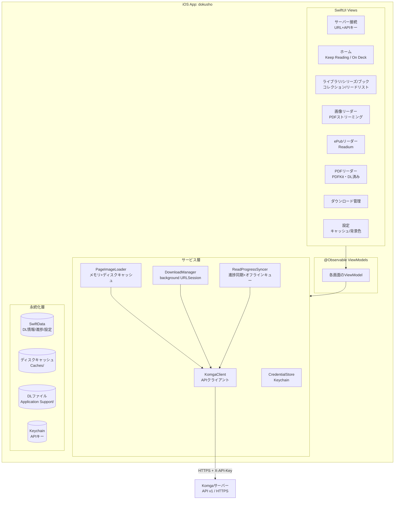

# 詳細設計書 - iOS向けKomga対応リーダーアプリ「dokusho」

要件定義書: `.tmp/requirements.md`（2026-07-09 ユーザー改訂版に基づく）

## 0. 要件の前提(改訂版の反映)

- 認証は**APIキー(`X-API-Key`)のみ**。Basic認証・自己署名証明書・HTTP接続は非対応(**HTTPS必須**)
- サーバーは**1台のみ**登録(複数サーバー切替なし)
- **対象フォーマットはePub / PDFのみ**。コミック(CBZ/CBR/DIVINA)は完全に対象外(ストリーミングもDLも行わない)
- **ストリーミング閲覧の対象はPDF**(Komgaがページを画像化して配信)。ePubはDLして閲覧
- 必須機能に昇格: **見開き表示 / コレクション・リードリスト / Keep Reading・On Deck / リーダー背景色設定 / バックグラウンドDL / iPad対応**
- 縦スクロール(Webtoon)モードは非対応

## 1. アーキテクチャ概要

### 1.1 システム構成図



### 1.2 技術スタック

- **言語**: Swift 5.10+(Strict Concurrency有効)
- **UI**: SwiftUI(iOS 17以上、`@Observable` / NavigationStack)。iPhone / iPad ユニバーサル対応
- **非同期処理**: Swift Concurrency(async/await, actor)
- **永続化**: SwiftData(DL情報・読書進捗・ローカル設定)、Keychain(APIキー)
- **主要ライブラリ**(Swift Package Manager):
  - **Readium Swift Toolkit**(ePubレンダリング: `ReadiumShared` / `ReadiumStreamer` / `ReadiumNavigator`)
  - **PDFKit**(標準、DL済みPDFのレンダリング)
  - 画像キャッシュは自前実装(`X-API-Key`ヘッダー付きリクエストとキャッシュキー制御のため)
- **ビルド/テスト**: Xcode 16+、Swift Testing
- **プロジェクト構成**: アプリターゲット + ローカルSPMパッケージ(`KomgaKit`)

### 1.3 モジュール構成

```
dokusho/
├── Dokusho.xcodeproj
├── Dokusho/                    # アプリターゲット
│   ├── App/                    # エントリポイント、DI、ルーティング
│   ├── Features/
│   │   ├── Connection/         # サーバー登録(URL+APIキー)
│   │   ├── Home/               # Keep Reading / On Deck
│   │   ├── Browse/             # ライブラリ/シリーズ/ブック/コレクション/リードリスト
│   │   ├── ImageReader/        # 画像リーダー(単ページ/見開き)
│   │   ├── EpubReader/         # Readiumラッパー
│   │   ├── PdfReader/          # PDFKitラッパー
│   │   ├── Downloads/          # DL管理画面
│   │   └── Settings/           # キャッシュ管理・リーダー背景色
│   ├── Services/               # ImageLoader, DownloadManager, ProgressSync, CredentialStore
│   └── Models/                 # SwiftDataモデル
└── Packages/
    └── KomgaKit/               # Komga APIクライアント(UI非依存・単体テスト対象)
        ├── Sources/KomgaKit/
        └── Tests/KomgaKitTests/
```

## 2. コンポーネント設計

### 2.1 コンポーネント一覧

| コンポーネント | 責務 | 依存関係 |
|---|---|---|
| `KomgaClient` (KomgaKit) | Komga API v1への型付きアクセス(APIキー認証)、ページング | URLSession |
| `CredentialStore` | APIキーのKeychain保存/取得/削除 | Security.framework |
| `PageImageLoader` | ページ画像・サムネイルの取得とメモリ/ディスクキャッシュ、先読み | KomgaClient |
| `DownloadManager` | ePub/PDFのバックグラウンドDL、進捗、キャンセル、削除 | KomgaClient, SwiftData |
| `ReadProgressSyncer` | 進捗のサーバー同期、オフラインキュー、復帰時フラッシュ | KomgaClient, SwiftData |
| 各`ViewModel` | 画面状態管理、サービス呼び出し | 上記サービス群 |

### 2.2 各コンポーネントの詳細

#### KomgaClient(KomgaKit)

- **目的**: Komga API v1へのアクセスを型安全に提供。UI非依存で単体テスト可能。
- **公開インターフェース**(抜粋):

```swift
public struct KomgaServerConfig: Sendable {
    public let baseURL: URL      // https必須(イニシャライザで検証)
    public let apiKey: String    // X-API-Key ヘッダー
}

public struct KomgaClient: Sendable {
    public init(config: KomgaServerConfig, session: URLSession = .shared)

    // 接続確認・認証チェック
    public func currentUser() async throws -> KomgaUser            // GET /api/v2/users/me

    // 一覧
    public func libraries() async throws -> [KomgaLibrary]         // GET /api/v1/libraries
    public func series(libraryID: String?, search: String?,
                       page: Int, size: Int) async throws -> Page<KomgaSeries>   // GET /api/v1/series
    public func books(seriesID: String,
                      page: Int, size: Int) async throws -> Page<KomgaBook>      // GET /api/v1/series/{id}/books
    public func book(id: String) async throws -> KomgaBook          // GET /api/v1/books/{id}

    // ホーム
    public func keepReading(page: Int, size: Int) async throws -> Page<KomgaBook>
        // GET /api/v1/books?read_status=IN_PROGRESS&sort=readProgress.readDate,desc
    public func onDeck(page: Int, size: Int) async throws -> Page<KomgaBook>
        // GET /api/v1/books/ondeck

    // コレクション / リードリスト
    public func collections(page: Int, size: Int) async throws -> Page<KomgaCollection>   // GET /api/v1/collections
    public func collectionSeries(id: String, page: Int, size: Int) async throws -> Page<KomgaSeries>
        // GET /api/v1/collections/{id}/series
    public func readLists(page: Int, size: Int) async throws -> Page<KomgaReadList>       // GET /api/v1/readlists
    public func readListBooks(id: String, page: Int, size: Int) async throws -> Page<KomgaBook>
        // GET /api/v1/readlists/{id}/books

    // ページ(ストリーミング)
    public func pages(bookID: String) async throws -> [KomgaPage]   // GET /api/v1/books/{id}/pages
    public func pageImageRequest(bookID: String, page: Int,
                                 convert: ImageConversion?) -> URLRequest
        // GET /api/v1/books/{id}/pages/{n}  (1-based, convert=jpeg|png)

    // ダウンロード(ePub/PDF)
    public func fileDownloadRequest(bookID: String) -> URLRequest   // GET /api/v1/books/{id}/file

    // サムネイル
    public func thumbnailRequest(for target: ThumbnailTarget) -> URLRequest
        // GET /api/v1/{books|series|collections|readlists}/{id}/thumbnail

    // 進捗
    public func updateReadProgress(bookID: String, page: Int?,
                                   completed: Bool?) async throws
        // PATCH /api/v1/books/{id}/read-progress (ReadProgressUpdateDto)
}
```

- **内部実装方針**:
  - 全リクエストに`X-API-Key`ヘッダーを付与。セッションCookieに依存しないステートレス方式(APIキーが毎回有効なため、要件の「ログイン維持」はAPIキーのKeychain保存で満たす)
  - `baseURL`は`https`スキームのみ受け付け、それ以外はイニシャライザでエラー
  - レスポンスはKomgaのDTO(`Page<T>`: `content/totalPages/number` 等)を`Decodable`でマップ
  - 画像・ファイル系は`URLRequest`を返す設計(`PageImageLoader`/`DownloadManager`がダウンロード方法を制御)
  - エラーは`KomgaError`(後述)に正規化

#### CredentialStore

- **目的**: APIキーをKeychainに安全に保存

```swift
struct CredentialStore: Sendable {
    func saveAPIKey(_ key: String) throws
    func loadAPIKey() throws -> String?
    func deleteAPIKey() throws
}
```

- **内部実装方針**: `kSecClassGenericPassword`、`kSecAttrAccessibleAfterFirstUnlock`。サーバーURL等の非機密情報はSwiftDataに保存し、APIキーのみKeychainへ。取得失敗時はフォールバックせず明示的にエラー(再設定画面へ誘導)。

#### PageImageLoader

- **目的**: ページ画像/サムネイルの取得・キャッシュ・先読み

```swift
actor PageImageLoader {
    init(client: KomgaClient, memoryLimit: Int, diskLimit: Int)

    func image(bookID: String, page: Int) async throws -> UIImage
    func thumbnail(for target: ThumbnailTarget) async throws -> UIImage
    func prefetch(bookID: String, pages: [Int])
    func cancelPrefetch(bookID: String, pages: [Int])

    func diskUsage() async -> Int
    func clearCache() async
}
```

- **内部実装方針**:
  - 2層キャッシュ: `NSCache`(メモリ、コストは画素数ベース) → ディスク(`Caches/PageCache/`、キーは `bookID/page` のSHA256)
  - ディスクキャッシュはLRU evict(上限既定 1GB、設定で変更可)
  - 同一ページへの同時リクエストはin-flightタスクを共有(重複取得防止)
  - 先読みは進行方向に非対称(進行方向+4 / 逆方向+1)。見開き表示時は見開き2枚単位で解釈
  - ページ取得はまずAcceptヘッダーのコンテンツネゴシエーションに任せ、デコード失敗時のみ`convert=jpeg`で再取得(WebP対策)
  - メモリ警告(`didReceiveMemoryWarningNotification`)でNSCacheをクリア

#### DownloadManager

- **目的**: ePub/PDFのバックグラウンドダウンロードとローカル管理

```swift
@Observable final class DownloadManager {
    enum DownloadState { case notDownloaded, downloading(progress: Double), downloaded, failed(Error) }

    func state(for bookID: String) -> DownloadState
    func download(book: KomgaBook) async     // mediaProfileがEPUB/PDF以外はエラー
    func cancel(bookID: String)
    func delete(bookID: String) throws
    func localURL(for bookID: String) -> URL?
    func totalDownloadedSize() -> Int
}
```

- **内部実装方針**:
  - `URLSessionConfiguration.background(withIdentifier:)`によるバックグラウンドDL。アプリがサスペンドされても継続し、完了イベントは`handleEventsForBackgroundURLSession`で受領
  - `X-API-Key`ヘッダーを含む`fileDownloadRequest`をそのままbackground URLSessionに渡す
  - 保存先: `Application Support/Downloads/{bookID}/book.{epub|pdf}`(`isExcludedFromBackup = true`)
  - 対象判定は`KomgaBook.media.mediaProfile`(`EPUB` / `PDF`)。それ以外のブックは一覧でグレーアウト表示し、開けない(非対応フォーマットの旨を表示)
  - DLメタデータ(状態・サイズ・日時)はSwiftDataの`DownloadedBook`に記録。アプリ再起動時にファイル実在と突き合わせて整合性回復
  - 失敗時は`resumeData`があればレジューム、なければ最初から

#### ReadProgressSyncer

- **目的**: 読書進捗のサーバー同期とオフライン耐性

```swift
actor ReadProgressSyncer {
    func recordProgress(bookID: String, page: Int, completed: Bool) async
    func flushPending() async     // オンライン復帰時・アプリ起動時に呼ぶ
}
```

- **内部実装方針**:
  - ページめくりごとに呼ばれるが、サーバー送信は2秒デバウンス
  - 送信失敗時はSwiftDataの`PendingProgress`に保存し、`NWPathMonitor`でオンライン復帰を検知して`flushPending()`
  - 同一ブックの複数保留は最新のみ残す

### 2.3 リーダーUI設計

#### 画像リーダー(PDFのストリーミング閲覧)

- **対象**: `mediaProfile`が`PDF`の未DLブック。Komgaがページを画像化して配信するため、`pages/{n}`エンドポイントでストリーミング閲覧できる
- **ページング**: `UIPageViewController`をUIViewControllerRepresentableでラップ
  - **左送り(RTL・右綴じ)/ 右送り(LTR・左綴じ)**: ジェスチャ方向の意味を`ReadingProgression`(`.rtl` / `.ltr`)で反転。前後ページ提供ロジックで吸収
  - SwiftUIのScrollView pagingではなくUIPageViewControllerを採用する理由: ズーム用`UIScrollView`との入れ子ジェスチャ競合の解決が安定しているため
- **見開き表示(必須)**: 横向き(またはiPadのregular幅)時に`spineLocation: .mid`で2ページ表示。読み方向に応じて左右ページの割当を反転。表紙(1ページ目)は単独表示
- **ズーム**: 各ページを`UIScrollView`(min 1x / max 4x) + `UIImageView`。ダブルタップで2倍⇔等倍
- **タップゾーン**: 左1/3・右1/3タップで進む/戻る(読み方向に追従)、中央タップでHUD(スライダー・設定)表示切替
- **初期読み方向**: `KomgaSeries.metadata.readingDirection`(`LEFT_TO_RIGHT` / `RIGHT_TO_LEFT`) → 未設定時はLTR。リーダー内トグルで上書き可(ブック単位でSwiftDataに記憶)。`VERTICAL`/`WEBTOON`指定のシリーズも横ページめくりで表示(縦スクロール非対応のため)
- **背景色設定(必須)**: 黒 / 白 / システム連動(ダークモード追従)の3択。`UserDefaults`保存

#### ePubリーダー(DL済みのみ)

- Readium `EPUBNavigatorViewController`をラップ。ローカルePubファイルから`Publication`を開く
- 進捗は`locator.locations.progression`をKomgaのページ番号に近似変換して同期(正確な対応はKomgaのpositions系APIを実装時に確認)
- ストリーミングePub(WebPub manifest経由)は非対応。ePubは「DLして読む」動線に統一

#### PDFリーダー(DL済み)

- `PDFView`(`displayMode: .singlePage`、`displaysRTL`で読み方向対応、横向き時`.twoUp`で見開き)
- 未DL時は画像リーダーでストリーミング表示(画像化のためテキスト選択不可。DL済みはPDFKitでベクター表示)

#### iPad対応(必須)

- `NavigationSplitView`によるサイドバー(ホーム/ライブラリ/コレクション/リードリスト/DL/設定) + コンテンツ
- 一覧グリッドはサイズクラスで列数可変。リーダーは全デバイスでフルスクリーン

## 3. データフロー

### 3.1 ストリーミング閲覧のフロー

```
ImageReaderView ─ページ表示要求→ ReaderViewModel
    → PageImageLoader.image(bookID:page:)
        NSCache? → DiskCache? → KomgaClient(pages/{n})
    ← UIImage(表示と同時に prefetch で前後ページを先読み)
    → ページ確定後 ReadProgressSyncer.recordProgress()(2秒デバウンスでPATCH)
```

### 3.2 ダウンロード(ePub/PDF)のフロー

```
ブック詳細 ─DLボタン→ DownloadManager.download(book)
    → background URLSession で /file を取得(アプリサスペンド中も継続)
    → 完了時 Application Support へ移動、SwiftData DownloadedBook 更新
閲覧時: localURL からReadium(ePub) / PDFKit(PDF)で表示(ネットワーク不要)
```

### 3.3 データモデル(SwiftData)

```swift
@Model final class ServerConfig {        // 1レコードのみ(単一サーバー)
    var baseURL: URL
    var serverName: String
    var connectedAt: Date
}

@Model final class DownloadedBook {
    var bookID: String
    var title: String; var seriesTitle: String
    var mediaProfile: String          // EPUB | PDF
    var state: String; var totalBytes: Int
    var downloadedAt: Date?
}

@Model final class LocalReadingState {
    var bookID: String
    var lastPage: Int; var completed: Bool
    var readingDirectionOverride: String?   // ユーザー上書き
    var updatedAt: Date
}

@Model final class PendingProgress {
    var bookID: String
    var page: Int; var completed: Bool; var queuedAt: Date
}
```

## 4. APIインターフェース

### 4.1 内部API

セクション2.2のインターフェース定義参照。層間の依存は「View → ViewModel → Service → KomgaKit」の一方向のみ。ServiceはViewを知らない。

### 4.2 外部API(Komga API v1) — 使用エンドポイント一覧

| 用途 | メソッド/パス | 備考 |
|---|---|---|
| 認証確認 | `GET /api/v2/users/me` | 接続テスト兼用 |
| ライブラリ一覧 | `GET /api/v1/libraries` | |
| シリーズ一覧 | `GET /api/v1/series` | `library_id`, `search`, `page`, `size` |
| シリーズ内ブック | `GET /api/v1/series/{id}/books` | `page`, `size` |
| ブック詳細 | `GET /api/v1/books/{id}` | `media.mediaProfile`で種別判定 |
| Keep Reading | `GET /api/v1/books?read_status=IN_PROGRESS` | `sort=readProgress.readDate,desc` |
| On Deck | `GET /api/v1/books/ondeck` | |
| コレクション | `GET /api/v1/collections`, `GET /api/v1/collections/{id}/series` | |
| リードリスト | `GET /api/v1/readlists`, `GET /api/v1/readlists/{id}/books` | |
| ページ一覧 | `GET /api/v1/books/{id}/pages` | ページ数・mediaType取得 |
| ページ画像 | `GET /api/v1/books/{id}/pages/{n}` | 1-based。`convert=jpeg`はデコード失敗時のみ |
| ファイルDL | `GET /api/v1/books/{id}/file` | ePub/PDFのみ |
| サムネイル | `GET /api/v1/{books\|series\|collections\|readlists}/{id}/thumbnail` | |
| 進捗更新 | `PATCH /api/v1/books/{id}/read-progress` | `{page?, completed?}` |

認証: 全リクエストに`X-API-Key`ヘッダーを付与。ステートレス(セッションCookie不使用)。

## 5. エラーハンドリング

### 5.1 エラー分類

```swift
enum KomgaError: Error {
    case invalidAPIKey             // 401 → APIキー再設定画面へ誘導
    case forbidden                 // 403 → 権限エラー表示
    case notFound                  // 404 → 「サーバーから削除された可能性」表示
    case serverError(status: Int)  // 5xx → リトライ可能エラーとして表示
    case network(URLError)         // 接続不可/タイムアウト → オフライン判定と再試行UI
    case decoding(Error)           // 想定外レスポンス → バージョン非互換の可能性を表示
    case insecureURL               // httpsでないURL → 登録時に拒否
}
```

- **ストリーミング中の回線断**: ページ取得は自動リトライ(指数バックオフ、最大2回)。失敗時はページ位置にエラープレースホルダ+タップ再試行
- **DL中の失敗**: background URLSessionの`resumeData`があればレジューム、なければ最初から
- **進捗同期失敗**: オフラインキューで吸収(ユーザーへのエラー表示はしない)

### 5.2 エラー通知

- ユーザー向け: 一覧系はコンテンツ領域にリトライ付きエラービュー、操作系はトースト/アラート
- ログ: `os.Logger`(subsystem: `jp.moongift.dokusho`)。APIキー・認証ヘッダーはログ出力禁止

## 6. セキュリティ設計

### 6.1 認証・認可

- APIキーはKeychain(`kSecAttrAccessibleAfterFirstUnlock`)のみに保存。UserDefaults等への平文保存禁止
- メモリ上のAPIキーは`KomgaClient`内に閉じ込め、ログ・エラーメッセージに含めない

### 6.2 データ保護

- **HTTPS必須**。ATSは既定のまま(例外設定なし)。`http://` URLは登録時に`insecureURL`エラーで拒否
- DLファイル・キャッシュは`Application Support`/`Caches`配下(サンドボックス内、`isExcludedFromBackup = true`)

## 7. テスト戦略

### 7.1 単体テスト

- **対象**: KomgaKit(最優先)、PageImageLoaderのキャッシュロジック、ReadProgressSyncerのデバウンス/キュー
- **手法**: Swift Testing。`URLProtocol`モックでHTTPレスポンスをスタブし、KomgaClientのリクエスト生成(`X-API-Key`ヘッダー・パス・クエリ)とDTOデコードを検証
- **カバレッジ目標**: KomgaKit 80%以上、サービス層 60%以上

### 7.2 統合テスト

- 実サーバー(開発用Komga)に対する手動シナリオテスト(受け入れテスト項目に準拠)
- リーダーUIのジェスチャ・読み方向・見開きは実機(iPhone/iPad)での手動確認を基本とする

## 8. パフォーマンス最適化

### 8.1 想定される負荷

- 数千シリーズのライブラリ、数百ページのPDF、100MB超のPDF/ePub

### 8.2 最適化方針

- 一覧: APIページネーション(size=50) + `LazyVGrid`。サムネイルは表示セルのみ取得しスクロールで先読み
- リーダー: 前後ページの先読み(進行方向+4/逆方向+1)、表示解像度に応じた`UIImage`ダウンサンプリング(`ImageIO`の`kCGImageSourceThumbnailMaxPixelSize`)
- メモリ: NSCache上限(画素数換算で約150MB相当。見開き時は2枚同時保持を考慮)、メモリ警告で解放
- ディスク: ページキャッシュLRU上限1GB(設定変更可)、サムネイルは別枠200MB

## 9. デプロイメント

### 9.1 デプロイ構成

- 配布: 開発者の実機(Development) → TestFlight → App Store(将来)
- 最小構成: Xcodeプロジェクト1つ + ローカルSPM。CIはMVPでは設定しない

### 9.2 設定管理

- ユーザー設定(キャッシュ上限、既定読み方向、リーダー背景色)は`UserDefaults`(機密情報は置かない)
- ビルド設定はxcconfigで管理(Bundle ID: `jp.moongift.dokusho` 仮)

## 10. 実装上の注意事項

- **ページ番号は1-based**(Komga APIの`pages/{n}`既定)。0-based混在バグに注意(`zero_based`パラメータは使わない)
- 見開き表示の表紙単独表示・端数ページの扱い(最終ページが単独になるケース)に注意
- ePubの進捗(progression 0.0〜1.0)とKomgaのページ番号の対応は実装時にpositions系APIで検証してから確定する
- ReadiumはSPMで導入しバージョンを固定する(メジャーアップデートでAPIが変わりやすいため)
- バックグラウンドDLの完了ハンドラ(`handleEventsForBackgroundURLSession`)はSwiftUIアプリでは`UIApplicationDelegateAdaptor`経由で受ける
- SwiftDataの`ModelContainer`はアプリで単一インスタンスを共有し、actor間受け渡しは`PersistentIdentifier`で行う
- Swiftで`Any`型・強制アンラップ(`!`)の使用は原則禁止
- フォールバック値でエラーを握りつぶさない(CLAUDE.mdルール準拠)。APIキーが取得できない場合は明示的にエラーを出し再設定画面へ誘導する
